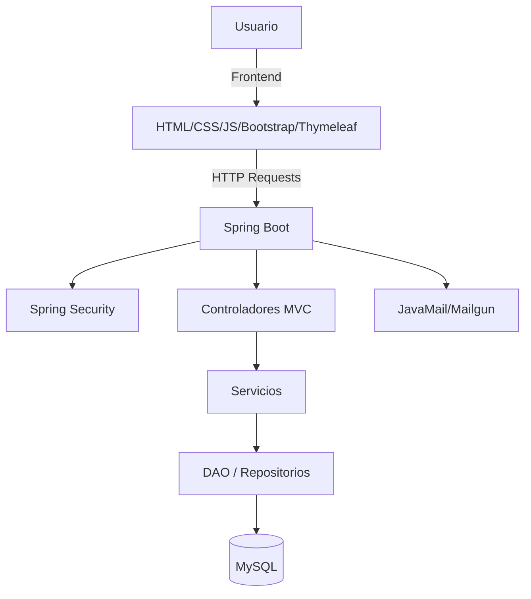

# 🛒 UTP Market


**UTP Market** es una plataforma exclusiva para estudiantes de la **Universidad Tecnológica del Perú (UTP)** que permite **comprar, vender e intercambiar** productos y servicios entre miembros verificados de la comunidad universitaria.  

---

## 📌 Objetivos

- Fomentar el emprendimiento entre estudiantes.
- Facilitar la economía circular en la UTP.
- Garantizar transacciones seguras con usuarios verificados.
- Brindar una experiencia ágil y centralizada.

---

## 🖥️ Tecnologías Utilizadas

**Frontend**  
 
 
 
 


**Backend**  


**Base de Datos**  


**Otras Herramientas**  


---

## ✨ Funcionalidades

- ✅ Registro con verificación de correo institucional `@utp.edu.pe`.
- 📦 Publicación de productos o servicios con imágenes, descripción y precios.
- 🔍 Búsqueda avanzada y filtrado por categorías, precio, ubicación y tipo de producto.
- 💬 Chat interno para negociación entre comprador y vendedor.
- ⭐ Reseñas y calificaciones de vendedores.
- 📊 Gestión y seguimiento de pedidos.

---

## 👤 Roles de Usuario

| Rol           | Permisos |
|---------------|----------|
| **Comprador** | Buscar, filtrar y comprar productos, comunicarse con vendedores, dejar reseñas. |
| **Vendedor**  | Publicar productos, responder mensajes, gestionar pedidos. |
| **Administrador** | Supervisar publicaciones, gestionar usuarios y reportes. |

---

## 🧩 Módulos del Sistema

1. **Autenticación y Seguridad**
   - Spring Security + validación de email institucional.
2. **Gestión de Productos**
   - Crear, editar, eliminar y listar productos.
3. **Búsqueda y Filtrado**
   - Consultas dinámicas optimizadas.
4. **Chat Interno**
   - Comunicación segura entre usuarios.
5. **Reseñas y Calificaciones**
   - Valoración de vendedores y experiencia de compra.
6. **Panel de Administración**
   - Gestión de usuarios, publicaciones y reportes.
7. **Notificaciones**
   - Email de verificación y alertas.

---

## 📐 Algoritmos Implementados

- **Búsqueda y filtrado optimizado**
  - Algoritmo por criterios múltiples.
- **Ordenamiento de productos**
  - Por precio, fecha o relevancia.
- **Recomendaciones simples**
  - Basadas en historial de búsqueda.

---

## 🏗️ Patrones de Diseño

- **MVC** → Separación de la lógica de negocio y la presentación.
- **DAO** → Manejo de acceso a datos independiente de la lógica de negocio.
- **Singleton** → Configuraciones y variables globales.
- **Strategy** → Manejo flexible de diferentes tipos de productos.

---

## 📊 Diagrama de Arquitectura


---
# 1️⃣ Clonar el repositorio
```
git clone https://github.com/usuario/utp-market.git
```

# 2️⃣ Entrar al directorio del proyecto
```
cd utp-market
```

# 3️⃣ Configurar la base de datos en application.properties
```
spring.datasource.url=jdbc:mysql://localhost:3306/utp_market
spring.datasource.username=root
spring.datasource.password=tu_password
```

# 4️⃣ Ejecutar el proyecto
```
mvn spring-boot:run
```
---